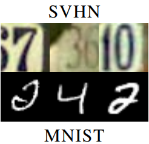

## Implementation of _Gradient Reversal_ method for MNIST & SVHN datasets

`System: Ubuntu 18.04`

`Platform: Pytorch`

The paper can be found [here](https://arxiv.org/pdf/1409.7495.pdf).

### Install Package dependencies
```
* pytorch>=1.0.0
* gzip
* tensorboardx
* numpy
* matplotlib
```

Following all steps:

If you have a Nvidia GPU, you can simply install all requirements via command: `conda install --file requirements.txt`. Otherwise, please comment out the `pytorch` and `torchvision` lines in `requirements.txt`, run the above command, and install `pytorch-cpu` with `conda install pytorch-cpu torchvision-cpu -c pytorch`.

### Download Data
Just run the command `python download_data.py` and all necessary datasets will be downloaded to `./data`. Here includes:
* Mnist Train set without labels
* Mnist Test set with labels
* SVHN Train set with labels
* SVHN Test set with labels

The goal was to reproduce the results claimed by the paper in the test `SVHN->Mnist`



### Training
Type `python main.py` and the program will re-train the network from scratch. On my machine, 100 `epochs` run in roughly 15' with one GTX 1080.

Run the command 'python valid.py' to download my pretrained model and run on test sets. Results will be printed.

Or put some number images in folder `images/` and run the command `python image_annotate.py -f <image-filename>` for some image annotations. For example, `python image_annotate -f img.jpg`

### Some technical details
* Input image is all of size `28x28` and rescaled to `[0, 1]`
* A Dropout layer (of rate 0.5 or 0.25) is added to the end of the Feature Extractor
* L2 Regularization with decay rate `1e-5`

Other hyperparameter details are as precised in the paper.

### Results
With these settings, I was able to reproduce the result in the paper, even a bit higher.

| | Paper | Me |
| --- | --- | --- |
| Mnist (target) | 71% | 72-75% |
| SVHN (source) | (not mentioned) | 93% |

### Brief Introduction


Recently, GAN can be seen as a newly technique that empowers the Deep Learning in tackling highly difficult tasks. Some popular examples are real-liked image generation, super resolution, style transfer, etc.

The paper _Unsupervised Domain Adaptation by Backprogation_ is among the finests when it comes the domain adaptation problem as it introduces a pretty simple yet elegant technique to deal with the domain differencies. Inspired by GAN, the paper's architecture is composed of a _Feature Extractor_ E, a _Domain Classifier_ D which tries to "fool" E to forget about the domain info, and lastly a _Classifier_ C to detect image's class.

A normal Neural Network is often composed only of E and C, with E extracts features (high-level info) and C bases on which to classify.

However, this approach hinders the network from being more generic. Given two datasets, one for training, one for testing. Though the twos may be of same type of data (number, text images, ...), the network may still end up behaving poorly in test.

The difference comes from some more subtle differencies, which we called in general _domain differencies_. Images can be taken from different sources, with difference in noise nature, effects of light, colors, etc. And that somehow has a nefast effect onto the nn's performance as the nn tends to encode these types of info also.
